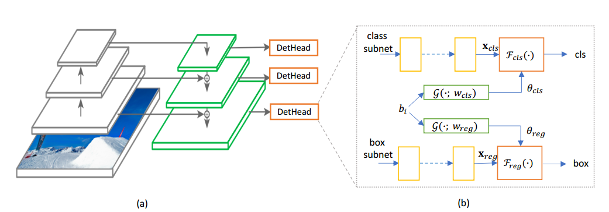
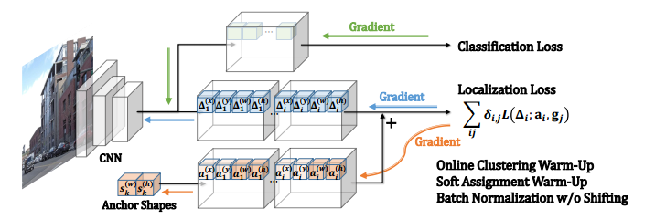
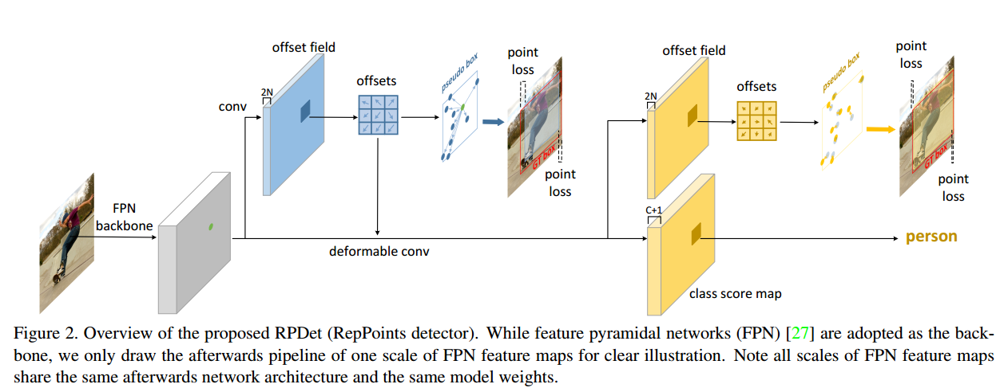

# Anchor Free 总结

## MetaAnchor

核心思想：

backbone与RetinaNet一致，区别在于head。传统的检测框架中，anchor的数量predefine好了之后最后一层卷积层的channel数量是固定好的，如3×3个anchor，那最后一层的channel是9.

Meta Anchor不需要预先定义所有的anchor数量，首先需要设置好很多的anchor shape（可以有任意多个），在训练的时候从集合中随机采样

## Anchor Box Optimization for Object Detection

 思想：在训练的时候直接回归anchor以及偏置

固定anchor的数量：5个;不固定anchor的shape（当作可学习参数学习）

## RepPoints

整体框架如图所示，注意此处backbone包含了特征融合部分。

1）在feature map上的每一个点预测一个n个点（n默认为9）用来表征目标，对比基于anchor的方法，此处只需预测（x，y，w，h），或者是左上右下两个点。然后再将n个点转化为一个矩形框，并用ground truth作为监督，产生损失，反传梯度。

2）同时对feature map做一次deformable卷积，其offset来自于1）中的9个点的值，然后在该feature map分别进行分类和回归的预测，注意此处回归依然是预测n个点，然后转化为矩形框，和真值进行匹配。

3）矩形框和reppoints转换方法：包括（1）采用极值点来表示矩形框，最多采用4个坐标值就能表示目标框，最少两个就行。（关于此处，如果只用四个点，那其余五个点岂不是起不到作用，也不会进行优化）（2）选取采用9个点的子集，然后采用（1）的方法。（3）采用9个点的均值作为目标框的中心，二阶矩作为目标框的宽和高。

4）训练样本：和yolo的方式类似，如果目标框真值的中心点落在对应feature map的点，就负责预测该框。（不知道是不是得益于这种方式，该方法的AP50较其他方法较高，在相同mAP的情况下）。