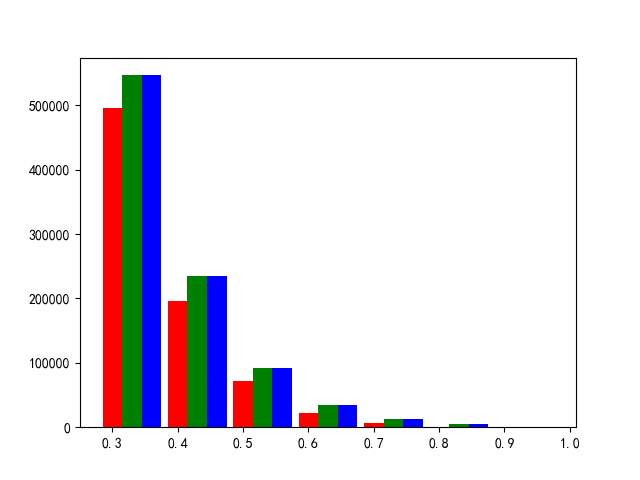

### single stage anchor visualize

横坐标为iou的大小

总坐标为anchor的个数（r表示anchor，g表示loc的预测结果，b表示loc2的预测结果）

如图，大约1280张图的比例

```
[507492. 200386.  72723.  23215.   5976.    969.      0.]
[559555. 240231.  94464.  34380.  12864.   5642.      0.] 
[559555. 240231.  94464.  34380.  12864.   5642.      0.]
```



结论：

​	loc1与locr2的预测结果看起来是一样的

​	在经过回归之后框确实回归的更准确了，但是在测试的时候经过loc2没有效果？

​	在每一个iou的stage上都回归的更准确了

​	


### Descartes RetinaNet

单卡bs最多到4

| backbone  |   pad style    | train BN |    epoch     | input size | batch size | gpus |  AP   |
| :-------: | :------------: | :------: | :----------: | :--------: | :--------: | :--: | :---: |
| resnet50  | pad and resize |   True   | 25(9w iter)  |    640     |     16     |  4   | 25.5  |
| resnet50  | pad and resize |   True   | 25(9w iter)  |    640     |     32     |  8   | 21.4  |
| resnet50  | pad and resize |  False   | 25(9w iter)  |    640     |     32     |  8   | train |
|           |                |          |              |            |            |      |       |
| resnet50  | pad and resize |   True   | 50(18w iter) |    640     |     8      |  4   | 29.1  |
| resnet50  | pad and resize |   True   | 50(18w iter) |    640     |     16     |  4   | 30.9  |
| resnet50  | pad and resize |  False   | 50(18w iter) |    640     |     16     |  4   | 31.1  |
| resnet50  | pad and resize |  False   | 50(18w iter) |    640     |     32     |  8   | 28.6  |
|           |                |          |              |            |            |      |       |
|           |                |          |              |            |            |      |       |
| resnet101 | pad and resize |   True   | 50(18w iter) |    640     |     16     |  4   | 31.0  |
| resnet101 | pad and resize |   True   | 50(18w iter) |    640     |     32     |  8   | 28.8  |


