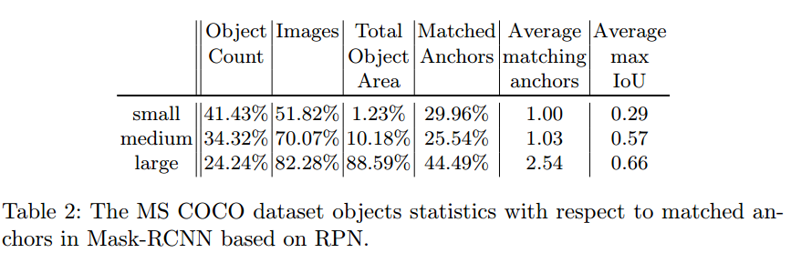

## Augmentation for small object detection

COCO数据构成

可以看出，小目标数量比较少，所占到的区域更小，能够match上的anchor也比较少

小目标检测之所以困难是因为，能够match上的anchor数量比较少

**本文的方法**

1.oversample：对于存在小物体的图像以3X的概率采样(在训练之前，搞好图片，比在训练的过程中随机采样要快)

2.copy and paste：对于一张图像中的所有小物体，全部在随机位置paste（size +-20%，rot +-15度），在paste的时候确保不与别的大目标有overlap，否则仍然可能造成准确率的下降

3.normal img : oversampel and aug img = 2 : 1

**Result**

7.1% gain for small objects but total AP is nearly same, so I think this augmentation strategy is harmful for large objects

